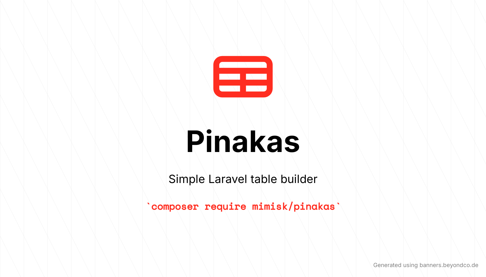

<p align="center">
    <a href="https://github.com/MimisK13/pinakas/actions/workflows/tests.yml"></a>
    <a href="https://packagist.org/packages/mimisk/pinakas"></a>
    <a href="https://packagist.org/packages/mimisk/pinakas"></a>
    <a href="LICENSE"></a>
</p>

Pinakas is a simple, reusable Laravel table builder package focused on fast CRUD listings.

## Requirements

- PHP `^8.2`
- Laravel `^11.0`, `^12.0`, or `^13.0`

## Installation

Via Composer

```bash
composer require mimisk/pinakas
```

Install JS dependency for `el-select`:

```bash
npm install @tailwindplus/elements
```

Publish package JS asset:

```bash
php artisan vendor:publish --tag=pinakas-assets
```

Import Pinakas JS in your app entrypoint (`resources/js/app.js`):

```js
import './vendor/pinakas/pinakas';
```

Rebuild assets:

```bash
npm run build
```

## Configuration

Publish config:

```bash
php artisan vendor:publish --tag=pinakas-config
```

`config/pinakas.php`:

```php
'empty_state' => [
    'title' => 'No records found',
    'description' => 'There are no rows available yet.',
    'search_title' => 'No matching results',
    'search_description' => 'Try a different keyword or clear your search.',
],

'search' => [
    'enabled' => false,
    'query_name' => 'search',
    'show_label' => true,
    'label' => 'Search',
    'placeholder' => 'Search...',
    'rounded' => 'rounded-none',
    'debounce_ms' => 350,
    'min_chars' => 3,
    'icon' => 'magnifying-glass',
],

'sorting' => [
    'enabled' => false,
    'query_name' => 'sort',
    'direction_query_name' => 'direction',
    'default_direction' => 'asc',
    'icon_position' => 'right', // left | right
],

'bulk' => [
    'selected_input_name' => 'selected_ids',
    'actions' => [],
],

'ui' => [
    'accent_color' => 'amber-600',
    'table_bordered' => false,
    'table_rounded' => 'rounded-xs',
    'table_striped' => false,
    'table_hoverable' => true,
    'pagination_dropdown_rounded' => 'rounded-none',
    'action_button_rounded' => 'rounded-none',
    'action_dropdown_rounded' => 'rounded-none',
],

'columns' => [
    'date_format' => 'd-m-Y',
    'time_format' => 'H:i',
],

'pagination' => [
    'enabled' => false,
    'default_per_page' => 15,
    'page_name' => 'page',
    'per_page_query_name' => 'per_page',
    'per_page_options' => [10, 25, 50],
    'show_label' => false,
    // Available: default, centered-page-numbers
    'template' => 'default',
],
```

These are global defaults and can be overridden per table.

## Usage

### Quick Start

```php
use App\Models\User;
use Mimisk\Pinakas\Actions\ActionGroup;
use Mimisk\Pinakas\Actions\DeleteAction;
use Mimisk\Pinakas\Actions\EditAction;
use Mimisk\Pinakas\Actions\ViewAction;
use Mimisk\Pinakas\Bulk\BulkAction;
use Mimisk\Pinakas\Columns\BadgeColumn;
use Mimisk\Pinakas\Columns\BooleanColumn;
use Mimisk\Pinakas\Columns\Column;
use Mimisk\Pinakas\Columns\DateColumn;
use Mimisk\Pinakas\Columns\TimeColumn;
use Mimisk\Pinakas\Pinakas;

$table = (new Pinakas())
    ->model(User::class)
    ->columns([
        Column::make('Id', 'id')->searchable()->sortable(),
        Column::make('Name', 'name')->searchable()->sortable(),
        Column::make('Email', 'email')->searchable()->sortable(),
        DateColumn::make('Created At', 'created_at')->format('d/m/Y H:i')->sortable(),
    ])
    ->actions([
        ActionGroup::make([
            ViewAction::make(),
            EditAction::make(),
            DeleteAction::make(),
        ]),
    ])
    ->bulkActions([
        BulkAction::make('Delete Selected')
            ->icon('trash')
            ->url('/users/bulk-delete')
            ->method('DELETE')
            ->confirm('Delete selected users?'),
    ])
    ->paginate(10)
    ->searchable()
    ->sortable()
    ->uiAccentColor('amber-600')
    ->bordered(true)
    ->tableRounded('rounded-xs')
    ->paginationDropdownRounded('rounded-none')
    ->actionButtonRounded('rounded-none')
    ->actionDropdownRounded('rounded-none')
    ->perPageOptions([10, 25, 50]);
```

### Rendering The Table View

Pass the table object to your Blade view:

```php
return view('welcome', [
    'table' => $table,
]);
```

Render the package table in Blade:

```blade
@include('pinakas::table', ['table' => $table])
```

### Columns

Define columns with label + model attribute:

```php
->columns([
    Column::make('Id', 'id'),
    Column::make('Name', 'name'),
    Column::make('Email', 'email'),
    Column::make('Created At', 'created_at'),
])
```

Column alignment:

```php
->columns([
    Column::make('Id', 'id')->align('center'), // header + cells
    Column::make('Name', 'name')->align('left'),
    Column::make('Amount', 'amount')->align('right'),
])
```

Header alignment (independent from cell alignment):

```php
->columns([
    Column::make('Amount', 'amount')
        ->cellAlign('right')    // cells only
        ->headerAlign('center') // header
])
```

Header label is optional in `make()`. If omitted, it is auto-generated
from the attribute:

```php
->columns([
    Column::make(attribute: 'created_at'), // "Created At"
    DateColumn::make(attribute: 'email_verified_at'), // "Email Verified At"
])
```

Date column type:

```php
use Mimisk\Pinakas\Columns\DateColumn;

->columns([
    DateColumn::make('Created At', 'created_at')
        ->format('d/m/Y H:i')
        ->timezone('Europe/Athens')
        ->emptyText('-'),
])
```

If `->format(...)` is omitted, DateColumn uses `columns.date_format` from config.

Time column type:

```php
use Mimisk\Pinakas\Columns\TimeColumn;

->columns([
    TimeColumn::make('Login Time', 'last_login_at')
        ->format('H:i')
        ->timezone('Europe/Athens')
        ->emptyText('-'),
])
```

If `->format(...)` is omitted, TimeColumn uses `columns.time_format` from config.

Badge column type:

```php
use Mimisk\Pinakas\Columns\BadgeColumn;

->columns([
    BadgeColumn::make('Status', 'status')
        ->color(fn ($value) => filled($value) ? 'green' : 'gray'),
])
```

Boolean column type:

```php
use Mimisk\Pinakas\Columns\BooleanColumn;

->columns([
    BooleanColumn::make('Verified', 'is_verified')
        ->labels('Verified', 'Not verified')
        ->colors('green', 'gray'),
])
```

### Actions (Single And Group)

Single actions:

```php
->actions([
    ViewAction::make(),
    EditAction::make(),
    DeleteAction::make(),
])
```

Grouped actions:

```php
->actions([
    ActionGroup::make([
        ViewAction::make(),
        EditAction::make(),
        DeleteAction::make(),
    ]),
])
```

### Pagination

Enable pagination:

```php
->paginate(10)
```

Second parameter defines page query key:

```php
->paginate(10, 'users_page')
```

Third parameter is optional label text (shown above dropdown):

```php
->paginate(10, 'users_page', 'Per Page')
```

Pagination template override per table:

```php
->paginationTemplate('centered-page-numbers')
```

You can also pass a direct view name:

```php
->paginationTemplate('my-custom.pagination')
```

### Search

Enable global search:

```php
->searchable()
```

Custom search query key:

```php
->searchable('q')
```

Override label / placeholder / icon per table:

```php
->searchLabel('Find User')
->searchPlaceholder('Type name or email')
->searchRounded('rounded-none')
->searchDebounceMs(300)
->searchMinChars(3)
->searchIcon('magnifying-glass') // or 'search', null, or custom view name
```

Hide label or icon:

```php
->showSearchLabel(false)
->searchIcon(null)
```

Mark specific columns as searchable:

```php
->columns([
    Column::make('Name', 'name')->searchable(),
    Column::make('Email', 'email')->searchable(),
    Column::make('Created At', 'created_at'), // not searchable
])
```

If no columns are marked, search is applied to all defined column attributes.

### Sorting

Enable sorting support for this table:

```php
->sortable()
```

Set icon position per table (override config):

```php
->sortIconPosition('right') // or 'left'
```

Custom sort query keys:

```php
->sortable('sort_by', 'sort_direction')
```

Mark sortable columns:

```php
->columns([
    Column::make('Id', 'id')->sortable(),
    Column::make('Name', 'name')->sortable(),
    Column::make('Email', 'email')->sortable(),
])
```

You can combine `->searchable()` and `->sortable()` safely.
Only columns marked with `->sortable()` become sortable.

### Bulk Actions

Register bulk actions:

```php
use Mimisk\Pinakas\Bulk\BulkAction;

->bulkActions([
    BulkAction::make('Delete Selected')
        ->icon('trash')
        ->url('/users/bulk-delete')
        ->method('DELETE')
        ->confirm('Delete selected users?'),
])
```

Customize selected IDs input name:

```php
->bulkSelectedInputName('ids')
```

Controller endpoint example:

```php
public function bulkDelete(Request $request)
{
    $ids = $request->input('selected_ids', []);
    User::query()->whereIn('id', $ids)->delete();

    return back();
}
```

### UI Settings

Override global accent color per table:

```php
->uiAccentColor('amber-600')
```

You may also pass CSS color values:

```php
->uiAccentColor('#d97706')
```

Control outer table border per table:

```php
->bordered(true)  // show border
->bordered(false) // hide border
```

Control table rounded class per table:

```php
->tableRounded('rounded-xs')
->tableRounded('rounded-lg')
->tableRounded('rounded-none')
```

Control striped rows per table:

```php
->striped()       // ON
->striped(false)  // OFF
```

Control hoverable rows per table:

```php
->hoverable()       // ON
->hoverable(false)  // OFF
```

Control rounded classes for controls:

```php
->paginationDropdownRounded('rounded-none')
->actionButtonRounded('rounded-none')
->actionDropdownRounded('rounded-none')
```

### Per-Page Selector

`Per page` dropdown appears automatically when pagination is enabled.
No label is shown by default.

`el-select` is powered by `@tailwindplus/elements` (npm).

```php
->perPageOptions([10, 25, 50])
```

Custom per-page query key:

```php
->perPageOptions([10, 25, 50], 'users_per_page')
```

Label visibility is controlled globally by `pagination.show_label`.
If `show_label = true` and no custom text is passed, default text is `Per page`.

### Loading State

The table includes a built-in loading overlay (spinner + reduced opacity) while form submissions and link navigations are in progress.
The UI classes include dark mode variants for table, controls, and loading state.

### Empty States

When the table has no data:

```php
->emptyState('No users yet', 'Create your first user to get started.')
```

When search has no matches:

```php
->searchEmptyState('No users found', 'Try another term or clear search.')
```

### Full Controller Example

```php
<?php

namespace App\Http\Controllers;

use App\Models\User;
use Mimisk\Pinakas\Actions\ActionGroup;
use Mimisk\Pinakas\Actions\DeleteAction;
use Mimisk\Pinakas\Actions\EditAction;
use Mimisk\Pinakas\Actions\ViewAction;
use Mimisk\Pinakas\Bulk\BulkAction;
use Mimisk\Pinakas\Columns\Column;
use Mimisk\Pinakas\Pinakas;

class TestController extends Controller
{
    public function showTable()
    {
        $table = (new Pinakas())
            ->model(User::class)
            ->columns([
                Column::make('Id', 'id')->searchable()->sortable(),
                Column::make('Name', 'name')->searchable()->sortable(),
                Column::make('Email', 'email')->searchable()->sortable(),
                Column::make('Created At', 'created_at'),
            ])
            ->actions([
                ActionGroup::make([
                    ViewAction::make(),
                    EditAction::make(),
                    DeleteAction::make(),
                ]),
            ])
            ->bulkActions([
                BulkAction::make('Delete Selected')
                    ->icon('trash')
                    ->url('/users/bulk-delete')
                    ->method('DELETE')
                    ->confirm('Delete selected users?'),
            ])
            ->paginate(10)
            ->searchable()
            ->sortable()
            ->perPageOptions([10, 25, 50]);

        return view('welcome', [
            'table' => $table,
        ]);
    }
}
```

### Notes

Route naming convention used by default actions:
- `user.show`
- `user.edit`
- `user.delete`

These are inferred from each row model class (example: `App\Models\User` -> `user.*`).

## Change log

Please see the [CHANGELOG](CHANGELOG.md) for more information on what has changed recently.

## Testing

```bash
composer install
composer test
```

Static analysis is handled by Larastan:

```bash
composer analyse
```

The GitHub workflow runs both Pest and Larastan against the supported Laravel matrix.

## Security

If you discover any security related issues, please email `mimisk88@gmail.com` instead of using the issue tracker.

## Credits

- [Mimis K][link-author]
- [All Contributors][link-contributors]

## License

MIT. Please see the [LICENSE file](LICENSE) for more information.

[link-author]: https://github.com/MimisK13
[link-contributors]: ../../contributors
